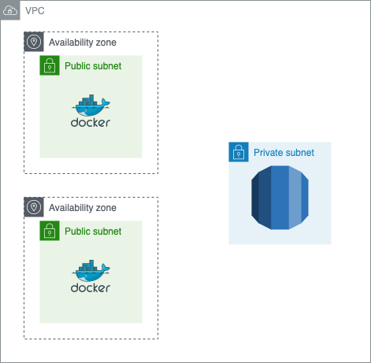

# OrthWeb - an open-source medical imaging repo and web portal

OrthWeb is a medical imaging PoC solution, built from **Orthanc** open-source project, on top of Amazon Web Service.

# Application

The application is provided by [Orthanc - DICOM Server](https://www.orthanc-server.com/), an open-source **DICOM server**. They [release](https://www.orthanc-server.com/download.php) in all common platforms, including [Docker image](https://hub.docker.com/u/jodogne/). The source code are available [here](https://hg.orthanc-server.com/). **DICOM** is a standard under ISO that defines how medical imaging data are exchanged between healthcare informatics systems. It involves DICOM Upper Layer Protocol, an OSI layer 7 protocol to allow data exchange over TCP/IP network. It also includes definition of file format, referred to as DICOM Part 10 file.

The Orthanc application receives medical imaging data from devices in DICOM protocol. It also allows clinical users to view images through web browser. The default credential is provided on the Orthanc website. This OrthWeb project includes the application in Docker and an example of Infrastructure as Code that hosts the environment.

# Infrastructure

The infrastructure is provisioned from AWS (Amazon Web Services), in Terraform. Terraform is an infrastructure as code tool that support multiple public cloud vendors, **AWS** being one of the popular providers. Here are the most basic commands in Terraform:

To initialize terraform template, run:
> terraform init

To view resources to be created, run:
> terraform plan

To execute the template, run:
> terraform apply

To reclaim the resources
> terraform destroy

To start provisioning resources, an AWS credential with sufficient privileges must be provided. More information about permissions are provided [here](https://www.terraform.io/docs/cloud/users-teams-organizations/permissions.html). The user only needs programatic access, with its Access Key ID and Secret access key on the client where terraform is executed. You should also configure local AWS cli environment by running:
> aws configure

Terraform's AWS provider is built with AWS SDK, therefore it automatically pick up local AWS environment, including the credentials, and region.

The Terraform template creates a virtual private cloud (VPC), a subnet, an EC2 instance. It also creates an RDS instance for PostgreSQL database as data store.

The bootstrap script of EC2 instance provisions Docker environment and load up the Docker image. This sample project provides a minimally functional stack without high availability and security setups, except for basic TLS configuration. Once the instance is launched, the public DNS name of the EC2 instance and RDS instances are printed. For validation:

* Web service will be available at: http://orthweb.ec2.url:8042
* DICOM entrypoint will be available as ORTHANC@orthweb.ec2.url:4242
* RDS will be accessible from the EC2 instance, on port 5432. To validate by psql client, run:
>psql --host=localhost --port 5432 --username=myuser --dbname=orthancdb

The application UI provides very intuitive visual components to open an exam, and preview instances (images). It also supports the ability to save DICOM studies as part 10 files. [Orthanc Book](https://book.orthanc-server.com/index.html) is the official resource in regard with the configuration, customization and implementation of Orthanc. 
