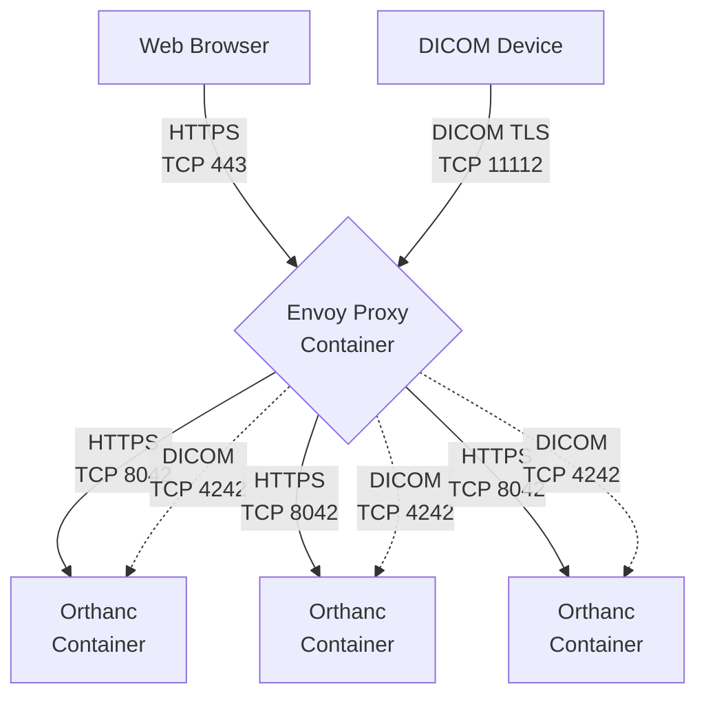

# Orthweb - Orthanc on AWS
<a href="https://www.orthanc-server.com/"></a>

[](https://www.docker.com/)
[](https://www.terraform.io/)
[](https://www.postgresql.org/)
[](https://www.envoyproxy.io/)
[](https://aws.amazon.com/amazon-linux-2)
[](https://portal.aws.amazon.com/)
[](https://opensource.org/licenses/Apache-2.0)
[](https://github.com/digihunch/orthweb/releases/latest) 
## Overview

 **[Orthweb](https://github.com/digihunch/orthweb)** helps imaging IT administrators operationalize **[Orthanc](https://www.orthanc-server.com/)** on AWS. It comes with self-contained, opionated and full-stack cloud resources defined in Terraform. Bring your own AWS account, and watch how **Orthweb** sets up the Orthanc server in 15 minutes to serve HTTP and DICOM traffic.

Using the [Orthanc image](https://hub.docker.com/r/osimis/orthanc) released by [Osimis](https://www.osimis.io/), the **[Orthweb](https://github.com/digihunch/orthweb)** project orchestrates numerous underlying cloud resources in AWS (e.g. VPC, subnets, Secret Manager, RDS, S3) and host **Orthanc** application with end-to-end automation, high availability and security. Here is the summary of current compliance status of the infrastructure stack, reported by BridgeCrew:
| Benchmark | Description |
| ----------- | --------- |
| [](https://www.bridgecrew.cloud/link/badge?vcs=github&fullRepo=digihunch%2Forthweb&benchmark=INFRASTRUCTURE+SECURITY) | Infrastructure Security Compliance |
| [](https://www.bridgecrew.cloud/link/badge?vcs=github&fullRepo=digihunch%2Forthweb&benchmark=CIS+AWS+V1.2) | Center for Internet Security, AWS Compliance |
| [](https://www.bridgecrew.cloud/link/badge?vcs=github&fullRepo=digihunch%2Forthweb&benchmark=NIST-800-53) | National Institute of Standards and Technology Compliance |
| [](https://www.bridgecrew.cloud/link/badge?vcs=github&fullRepo=digihunch%2Forthweb&benchmark=ISO27001) | Information Security Management System, ISO/IEC 27001 Compliance |
| [](https://www.bridgecrew.cloud/link/badge?vcs=github&fullRepo=digihunch%2Forthweb&benchmark=SOC2) | Service Organization Control 2 Compliance |
| [](https://www.bridgecrew.cloud/link/badge?vcs=github&fullRepo=digihunch%2Forthweb&benchmark=HIPPA) | Health Insurance Portability and Accountability Compliance |

## Use case

**Orthweb** demonstrates the idea of infrastructure-as-code, deployment automation and security options to host **Orthanc**. It is however not intended for production. How you can benefit from Orthweb depends on: 

<details><summary>Your role and goal </summary>
<p>

| Your role and goal | How you provision infrastructure for Orthanc | How you install Orthanc |
| ----------- | --------- | ---------- |
| You are a developer, sales, doctor, student, etc. You have your own AWS account, and just want to check out Orthanc website in 15 minutes.| [Orthweb](https://github.com/digihunch/orthweb) project creates its own networking and security layer. | [Orthweb](https://github.com/digihunch/orthweb) project installs Orthanc automatically. |
| You are a healthcare organization, start-up or corporate. Your organization has established [cloud foundation](https://docs.aws.amazon.com/whitepapers/latest/organizing-your-aws-environment/organizing-your-aws-environment.html). You want to configure Orthanc on top of it. | The infrastructure team configures [landing zone](https://docs.aws.amazon.com/prescriptive-guidance/latest/migration-aws-environment/understanding-landing-zones.html) with secure and compliant networking foundation. | The application team configures computing resource and with Orthanc installation, taking [Orthweb](https://github.com/digihunch/orthweb) as a reference. |
</p></details>

For those with Kubernetes skills to solve complex use cases, check out Orthweb's sister project [Korthweb](https://github.com/digihunch/korthweb).

Follow the rest of this hands-on guide to understand how **Orthweb** works. Skip to the end of the guide for architecture.

##  Architecture

Orthweb uses Docker Compose to orchestrate multiple Orthanc containers along with an Envoy proxy container. I did not choose ECS due to a [limitation](https://github.com/digihunch/orthweb/issues/1#issuecomment-852669561) and concerns with platform lock-in. To scale up, you may increase the number of replica for Orthanc containers. This scaling model is sufficient for typical Orthanc workload. 

The Orthweb architecture can be illustrated in the diagram below:


The site's IP is associated with an Elastic Network Interface (ENI). It is connected to the primary EC2 instance hosted in availability zone 1. Business traffic (DICOM and HTTP) are routed to the Site IP at port 11112 and 443. Docker damon runs Envoy proxy who listens to those ports. The Envoy proxy, serves two different proxy routes: 



The envoy proxy is configured to spread traffic across three Orthanc containers, with session affinity configured. Each Orthanc container is able to connect to S3 and PostgreSQL database via their respect endpoint in the subnet.

Should availability zone 1 becomes unavailable, system administrator can turn on the secondary EC2 instance in availability zone 2, and associate the ENI with site IP to it, as instructed in the `Failover` section above. This way we bring availability zone 2 to operation and redirect business traffic to it.


## Prerequisite
Whether on Linux, Mac or Windows, you need a command terminal to start deployment, with:
<details><summary>Required tools</summary>
<p>

* Make sure **[awscli](https://docs.aws.amazon.com/cli/latest/userguide/cli-chap-configure.html)** is installed and [configured](https://docs.aws.amazon.com/cli/latest/userguide/cli-chap-configure) so you can connect to your AWS account with as your IAM user (using `Access Key ID` and `Secret Access Key` with administrator privilege). If you will need to SSH to the EC2 instance, you also need to install [session manager plugin](https://docs.aws.amazon.com/systems-manager/latest/userguide/session-manager-working-with-install-plugin.html);
* Make sure **Terraform CLI** is [installed](https://learn.hashicorp.com/tutorials/terraform/install-cli). In the Orthweb template, Terraform also uses your IAM credential to [authenticate into AWS](https://registry.terraform.io/providers/hashicorp/aws/latest/docs#shared-credentials-file). 
</p>
</details>
The guide is based on local Terraform execution, and were tested on MacBook (arm64 and x86_64) and WSL2 (Ubuntu) on Windows. However, the steps can be adjusted to work on Windows or from managed Terraform environment (e.g. Scalr, Terraform Cloud). 

## Preparation
If you need to inspect or troubleshoot the Orthanc deployment, you will need to take the preparatory steps here. Otherwise, you can skip to the next section.

In this section, we set Terraform input variable to facilitate troubleshooting.

### Secure SSH access
There are two ways to SSH to the EC2 instances. To use your own choice of command terminal, you must configure your [RSA key pair](https://docs.aws.amazon.com/AWSEC2/latest/UserGuide/ec2-key-pairs.html) on the EC2 instances. Alternatively, without your own RSA key pair, you may use web-based command terminal from AWS console.

<details><summary>Configure RSA key pair to use your own command terminal </summary><p>

You need to [create your RSA key pair](https://help.dreamhost.com/hc/en-us/articles/115001736671-Creating-a-new-Key-pair-in-Mac-OS-X-or-Linux). Your public key will be stored as file `~/.ssh/id_rsa.pub` on MacOS or Linux by default. Here is how the template determines what to send to EC2 as authorized public key:

1. If you specify public key data in the input variable `pubkey_data`, then it will added as authorized public key when the EC2 instances are created.
2. If `pubkey_data` is not specified, then it looks for the file path specified in input variable `pubkey_path` for public key
3. If `pubkey_path` is not specified, then it uses default public key path `~/.ssh/id_rsa.pub` and pass the public key
4. If no file is found at the default public key path, then the template will not send a public key. The EC2 instances to be provisioned will not have an authorized public key. Your only option to SSH to the instance is using AWS web console.

Terraform template picks up environment variable prefixed with `TF_VAR_` and pass them in as Terraform's [input variable](https://developer.hashicorp.com/terraform/language/values/variables#environment-variables) without the prefix in the name. For example, if you set environment as below before running `terraform init`, then Terraform will pick up the value for input variables `pubkey_data` and `pubkey_path`:
```sh
export
TF_VAR_pubkey_data="mockpublickeydatawhichissuperlongdonotputyourprivatekeyherepleaseabcxyzpubkklsss"
TF_VAR_pubkey_path="/tmp/mykey.pub"
```

Your SSH client works in tandem with session-manager-plugin. You can add the following section to your local SSH configuration file (i.e. `~/.ssh/config`) so it allows the session manager proxies the SSH session for hostnames matching `i-*` and `mi-*`.

```
host i-* mi-*
    ProxyCommand sh -c "aws ssm start-session --target %h --document-name AWS-StartSSHSession --parameters 'portNumber=%p'"
    IdentityFile ~/.ssh/id_rsa
    User ec2-user
```
Then you will be able to directly ssh to an instance by its instance ID, even if the instance does not have a public IP. It will use Linux user `ec2-user`, which as the authorized public key pre-loaded.

</p></details>

<details><summary>Connect to AWS System Manager to use web terminal </summary><p>

Log on to AWS console, from `AWS System Manager` in your region, on the lef-hand pannel, under `Node Management`, select `Fleet Manager`. You should see your instances listed. Select the Node by the name, select `Node actions` and then `Start terminal session` (under `Connect`). It will take you to a web-based command console and logged in as `ssm-user`. You can switch to our `ec2-user` with sudo commands:
```bash
sh-4.2$ sudo -s
[root@ip-172-27-3-138 bin]# su - ec2-user
Last login: Wed Nov 23 22:02:57 UTC 2022 from localhost on pts/0
[ec2-user@ip-172-27-3-138 ~]$
```
</p></details>

Both mechanisms are enabled by default in the Terraform template.

### Customize deployment options
This project comes with working default but you can customize it in certain ways. For example,  if you want to run with own container image, different versions, different instance type, you may override the default by declaring environment variable `TF_VAR_DeploymentOptions`, for example:
<details><summary>Override Deployment Options </summary><p>

```sh
export TF_VAR_DeploymentOptions="{\"EnvoyImg\":\"envoyproxy/envoy:v1.22.5\",\"OrthancImg\":\"osimis/orthanc:22.11.3\",\"InstanceType\"=\"t2.medium\"}"
```
</p></details>

This is helpful to test newer version of Orthanc or Envoy proxy.

## Deployment

Now we can start deploying Orthanc. From your command terminal, go to directory [`terraform`](https://github.com/digihunch/orthweb/tree/main/terraform) and run `terraform` commands from there:

<details><summary>Deploy the Terraform template </summary><p>

First, initialize terraform modules:

> terraform init

The `init` command will initialize Terraform template, download providers, etc. If no error, we can plan the deployment:

> terraform plan

The `plan` command will check current state in the cloud and print out the resources to deploy. If the plan looks good, we can apply the deployment plan:

> terraform apply

You need to say `yes` to the prompt. Terraform kicks off the deployment.  
</p></details>

During deployment, Terraform provider interacts with your AWS account to provision the resources. Out of those resources, the EC2 instances contains a bootstrapping script which configures the Orthanc website as it is provisioned. The entire deployment process can take as long as 15 minutes.

Upon successful deployment, the output shall display four entries as output, as show below:
<details><summary>Output keys </summary><p>

|key|example value|protocol|purpose|
|--|--|--|--|
|**site_address**|ec2-54-243-91-148.compute-1.amazonaws.com|HTTPS/DICOM-TLS|Business traffic: HTTPS on port 443 and DICOM-TLS on port 11112. Reachable from the Internet.|
|**host_info**|Primary:i-02d92d2c1c046ea62    Secondary:i-076b93808575da71e|SSH|For management traffic. |
|**s3_bucket**|wealthy-lemur-orthbucket.s3.amazonaws.com|HTTPS-S3| For orthanc to store and fetch images. Access is restricted.|
|**db_endpoint**|wealthy-lemur-orthancpostgres.cqfpmkrutlau.us-east-1.rds.amazonaws.com:5432|TLS-POSTGRESQL| For orthanc to index data. Access is restricted.|
</p></details>


The EC2 instances will take a couple extra minutes after the output is printed, to finish  configuring Orthanc. We can validate the site with the steps outlined in the sections below. 

After the evaluation is completed, delete resources with `destroy` command:
<details><summary>Delete deployment </summary><p>

> terraform destroy
</p></details>

It is important to remember this last step to stop incurring cost on your AWS bill.

## User Validation
Now, we validate the website as an Orthanc user.

To Validate DICOM capability, we can test with C-ECHO and C-STORE. We can use any DICOM compliant application. For example, [Horos](https://horosproject.org/) on MacOS is a UI-based application. In Preference->Locations, configure a new DICOM nodes with
* Address: the site address as given above
* AE title: ORTHANC
* Port: 11112 (or otherwise configured)

Remember to enable TLS. Then you will be able to verify the node (i.e. C-ECHO) and send existing studies from Horos to Orthanc (C-STORE).

To Validate the the web service, simply visit the site address (with `https://` scheme) and put in the [preset credential](https://github.com/digihunch/orthweb/blob/main/app/orthanc.json#L6) at the credential prompt. Note that your web browser may flag the site as insecure because the server certificate's CA is self-signed and not trusted. 

Alternatively, you may use `curl` command to fetch the web content:

```sh
curl -HHost:web.orthweb.com -k -X GET https://ec2-35-183-66-248.ca-central-1.compute.amazonaws.com/app/explorer.html -u admin:orthanc --cacert ca.crt
```
The curl command should print out the web content.

## Technical Validation
In this section, we go through a few checkpoints through a system administrator's lens, to ensure the system is functional and correctly configured.

### Server Validation

Now we SSH to the server as `ec2-user`, as instructed above. Once connected, we can check cloud init log:
```sh
sudo tail -F /var/log/cloud-init-output.log
```
In the log, each container should say `Orthanc has started`. 

The configuration files related to Orthanc deployment are in directory `/home/ec2-user/orthweb/app`, including:

<details><summary>configuration files: </summary>
<p>

* `orthanc.json`: the Orthanc configuration file. Some values are specified as [environment variables](https://book.orthanc-server.com/users/configuration.html#environment-variables). Their value can be found in file `~/.orthanc.env`. For example, you can change `VERBOSE_ENABLED` to true and restart Docker compose for Orthanc verbose logging.
* `envoy.yaml`: the configuration file for Envoy proxy. Changes to this file should take effect rightaway. However, it is helpful to restart Docker container and watch for Envoy logs in case of configuration error.
* `compute-1.amazonaws.com.pem`: the file that contains the self-signed certificate and key that were generated during server bootstrapping. 
* `docker-compose.yml`: the file that tells `Docker-compose` how to orchestrate Docker containers. Changes to this file requires Docker-compose to restart to take effect.
* `.env`: the file that stores the environment variables being referenced in the `docker-compose.yml` file. Changes to this file requires Docker compose to restart to take effect.
</p></details>

Based on envoy proxy configuration, some additional logging files are located in `/home/envoy/` for troubleshooting Envoy proxy.

### DICOM Validation
To emulate DICOM activity,  we use [dcmtk](https://dicom.offis.de/dcmtk.php.en), with TLS options. We use the `echoscu` executable to issue `C-ECHO` DIMSE command, and the `storescu` executable to issue `C-STORE` commands. For example:
<details><summary>echoscu command for C-ECHO </summary><p>

```sh
echoscu -aet TESTER -aec ORTHANC -d +tls client.key client.crt -rc +cf ca.crt ec2-35-183-66-248.ca-central-1.compute.amazonaws.com 11112
```
The files `client.key`, `client.crt` and `ca.crt` can all be obtained from the /tmp/ directory on the server. 
</p></details>

The output should read Status code 0 in `C-ECHO-RSP`, followed by `C-ECHO-RQ`. Here is an example of the output from `storescu`:
<details><summary>C-ECHO log segment:</summary>
<p>

```
I: Association Accepted (Max Send PDV: 16372)
I: Sending Echo Request (MsgID 1)
D: DcmDataset::read() TransferSyntax="Little Endian Implicit"
I: Received Echo Response (Success)
I: Releasing Association
```
</p></details>

Further, we can store some DICOM part 10 file (usually .dcm extension containing images) to Orthanc server, using `storescu` executable:
<details><summary>storescu command to issue C-STORE</summary><p>

```sh
storescu -aet TESTER -aec ORTHANC -d +tls client.key client.crt -rc +cf ca.crt ec2-35-183-66-248.ca-central-1.compute.amazonaws.com 11112 DICOM_Images/COVID/56364823.dcm
```
</p></details>
Below is an example of what the output from `storescu` should look like:

<details><summary>C-STORE log segment:</summary><p>

```
D: ===================== OUTGOING DIMSE MESSAGE ====================
D: Message Type                  : C-STORE RQ
D: Message ID                    : 427
D: Affected SOP Class UID        : CTImageStorage
D: Affected SOP Instance UID     : 1.3.6.1.4.1.9590.100.1.2.227776817313443872620744441692571990763
D: Data Set                      : present
D: Priority                      : medium
D: ======================= END DIMSE MESSAGE =======================
D: DcmDataset::read() TransferSyntax="Little Endian Implicit"
I: Received Store Response
D: ===================== INCOMING DIMSE MESSAGE ====================
D: Message Type                  : C-STORE RSP
D: Presentation Context ID       : 41
D: Message ID Being Responded To : 427
D: Affected SOP Class UID        : CTImageStorage
D: Affected SOP Instance UID     : 1.3.6.1.4.1.9590.100.1.2.227776817313443872620744441692571990763
D: Data Set                      : none
D: DIMSE Status                  : 0x0000: Success
D: ======================= END DIMSE MESSAGE =======================
I: Releasing Association
```
</p></details>

C-STORE-RSP status 0 indicates successful image transfer, and the image should viewable from the Orthanc site address. 

### Database Validation

RDS is accessible only from the EC2 instance on port 5432. You can get the database URL and credential from file `/home/ec2-user/.orthanc.env`. To validate by psql client, run:
<details><summary>psql command</summary><p>

```sh
sudo amazon-linux-extras enable postgresql14
sudo yum install postgresql
psql --host=postgresdbinstance.us-east-1.rds.amazonaws.com --port 5432 --username=myuser --dbname=orthancdb
```
</p></details>
Then you are in the PostgreSQL command console and can check the tables using SQL, for example:
<details><summary>psql output</summary><p>

```sh
orthancdb=> \dt;
                List of relations
 Schema |         Name          | Type  | Owner
--------+-----------------------+-------+--------
 public | attachedfiles         | table | myuser
 public | changes               | table | myuser
 public | deletedfiles          | table | myuser
 public | deletedresources      | table | myuser
 public | dicomidentifiers      | table | myuser
 public | exportedresources     | table | myuser
 public | globalintegers        | table | myuser
 public | globalproperties      | table | myuser
 public | maindicomtags         | table | myuser
 public | metadata              | table | myuser
 public | patientrecyclingorder | table | myuser
 public | remainingancestor     | table | myuser
 public | resources             | table | myuser
 public | serverproperties      | table | myuser
(14 rows)

orthancdb=> select * from attachedfiles;
 id | filetype |                 uuid                 | compressedsize | uncompressedsize | compressiontype |         uncompressedhash         |          compressedhash          | revision
----+----------+--------------------------------------+----------------+------------------+-----------------+----------------------------------+----------------------------------+----------
  4 |        1 | 87719ef0-cbb1-4249-a0ac-e68356d97a7a |         525848 |           525848 |               1 | bd07bf5f2f1287da0f0038638002e9b1 | bd07bf5f2f1287da0f0038638002e9b1 |        0
(1 row)
```
</p></details>
This is as far as we can go in terms of validating database. Without the schema document, we are not able to interpret the content. It is also not recommended to tamper with the tables directly bypassing the application.

### Storage Validation

Storage validation can be performed simply by examining the content of S3 bucket. Once studies are sent to Orthanc, the corresponding DICOM file should appear in the S3 bucket. For example, we can run the following AWS CLI command from the EC2 instance:
<details><summary>CLI command to view buckets</summary><p>

```sh
aws s3 ls s3://bucket-name
2021-12-02 18:54:41     525848 87719ef0-cbb1-4249-a0ac-e68356d97a7a.dcm
```
</p></details>
The bucket is not publicly assissible and is protected by bucket policy configured during resource provisioning.

## Failover

To perform a failover, simply re-associate the elastic IP (for the site address) to the secondary instance by instance Id. Use AWS CLI to complete this task.

<details><summary> Steps to fail over</summary><p>

Find out the detail about the site address' elastic IP.
```sh
aws ec2 describe-addresses
```
Notice that the InstanceId should be the output value for the Primary Instance. Also note down the AllocationId. Then assocate it with the secondary instance's Id. For example:
```sh
aws ec2 associate-address --allocation-id eipalloc-094b88bf021e6670a --instance-id i-076b93808575da71e
```
Now describe IP address again:
```sh
aws ec2 describe-addresses
```
You should find that now the secondary instance's ID is associated with the Elastic IP.
</p></details>

To minimize cost, you may stop the secondary instance while the primary instance is functional. Start the secondary instance only when fail-over is needed. For example:
<details><summary> CLI command to stop and start instance</summary><p>


```sh
aws ec2 stop-instances --instance-ids i-076b93808575da71e
aws ec2 start-instances --instance-ids i-076b93808575da71e
```
</p></details>
The instance should be in a `stopped` state in order to be started again.

## Security

Orthweb project implements secure configuration as far as it can. For example, it configures a self-signed certificate in the demo. In production deployment however you should bring your own certificates signed by CA. Below are the points of configurations for security compliance:

<details><summary>Security configurations</summary><p>

1. Both DICOM and web traffic are encrypted in TLS. This requires peer DICOM AE to support DICOM TLS in order to connect with Orthanc.
2. PostgreSQL data is encrypted at rest, and the database traffic between Orthanc application and database is encrypted in SSL. The database endpoint is not open to public.
3. The S3 bucket has server side encryption. The traffic in transit between S3 bucket and Orthanc application is encrypted as well. The S3 endpoint is not open to public.
4. The password for database are generated dynamically and stored in AWS Secret Manager in AWS. The EC2 instance is granted access to the secret, which allows the cloud-init script to fetch the secret and launch container with it. 
5. The demo-purpose self-signed X509 certificate is dynamically generated using openssl11 during bootstrapping, in compliance with [Mac requirement](https://support.apple.com/en-us/HT210176).
6. Secret Manager and S3 have their respective VPC interface endpoint in each subnet. Traffic to and from Secret Manager and S3 travels via end points.
7. Secret Manager and S3 have resource-based IAM role to restrict access.
8. VPC flow log and S3 access log are sent to a separate S3 bucket. However, the S3 access log usually takes 10 minutes to be delivered.
</p></details>

Currently there are also some limitation with secure configuration:

<details><summary>Security configuration limitations</summary><p>

1. Database password is generated at Terraform client and then sent to deployment server to create PostgreSQL. The generated password is also stored in state file of Terraform. To overcome this, we need a) Terraform tells AWS secrets manager to generate a password; and b) it tells other AWS service to resolve the newly created secret. As of May 2021, a) is doable but b) isn't due to a limitation with Terraform
2. Secret management with Docker container: secret are presented to container process as environment variables, instead of file content. As per [this article](https://techbeacon.com/devops/how-keep-your-container-secrets-secure), this is not the best practice.
3. Orthweb provisions a self-signed certificate because it is free and easy to automate. Browser flags the site as insecure. If you have your own domain name and would rather host it with your own domain name. You can bring your own certificate, and store them in `site.pem`. You'll also need to add an CNAME record to point to the orthanc DNS name.

</p></details>
