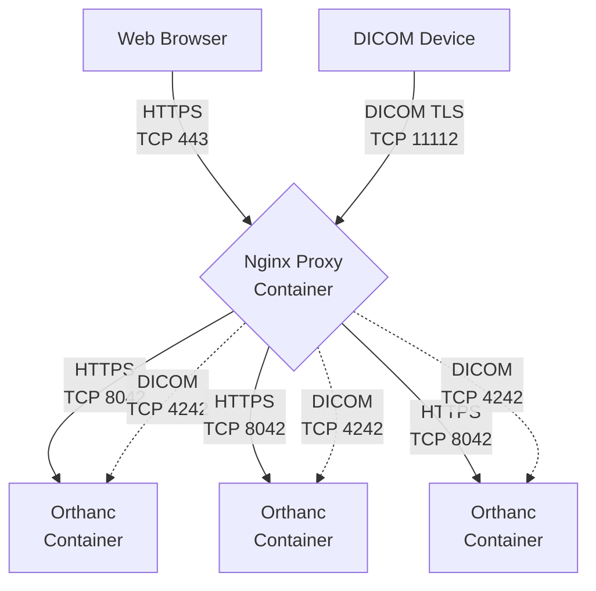

Orthweb deploys its own proposal of architecture on AWS. This section discusses how the architecture works.

## The Arthicture

The Orthweb Architecture can be illustrated in the diagram below:


The site's IP is associated with an Elastic Network Interface (ENI). It is connected to the primary EC2 instance hosted in availability zone 1. Business traffic (DICOM and HTTP) are routed to the Site IP at port 11112 and 443. 

Within each EC2 instance, Docker daemon runs the containers for Nginx proxy and Orthanc application. Orthweb uses [Docker Compose](https://docs.docker.com/compose/) to orchestrate the containers in such a way that three replicas of Orthanc containers operates behind one replica of Nginx proxy container. To scale up, you may increase the number of replicas for Orthanc containers. This scaling model is sufficient for typical Orthanc use cases. 

The Nginx proxy serves two different proxy routes: 



The Nginx proxy is configured to spread traffic across three Orthanc containers, with session affinity configured. Each Orthanc container is able to connect to S3 and PostgreSQL database via their respect endpoint in the subnet.


## Failover

Should availability zone 1 (AZ1) becomes unavailable, the system administrator can turn on the secondary EC2 instance in availability zone 2 (AZ2), and associate the ENI with site IP to this EC2 instance, which now will become primary. This way we bring AZ2 to operation and redirect business traffic to the containers in the EC2 instance in AZ2.

The containers in the EC2 instance from AZ2 also interacts with S3 and RDS, both of which inherently support multi-AZ.

To perform a failover, simply re-associate the website's elastic IP to the secondary instance by instance Id. Below is a common failover scenario:

To find out the detail about the site's elastic IP, issue the following CLI command:
```sh
aws ec2 describe-addresses
```
Notice that the InstanceId should be the output value for the Primary Instance. Also note down the AllocationId. Then assocate it with the secondary instance's Id. For example:
```sh
aws ec2 associate-address --allocation-id eipalloc-094b88bf021e6670a --instance-id i-076b93808575da71e
```
Now describe IP address again:
```sh
aws ec2 describe-addresses
```
You should find that now the secondary instance's ID is associated with the Elastic IP.

To minimize cost, you may stop the secondary instance while the primary instance is functional. Start the secondary instance only when fail-over is needed. For example:

```sh
aws ec2 stop-instances --instance-ids i-076b93808575da71e
aws ec2 start-instances --instance-ids i-076b93808575da71e
```
The instance should be in a `stopped` state in order to be started again.

## Site Certificate

Configuring TLS certificate is essential to the security of this architecture. However, provisioning the organization-specific TLS certificate requires cross-domain with organization's Public Key Infrastructure (PKI), which often takes time. Orthweb aims for an smooth end-to-end configuration experience so it employs self-signed certificate.

A self-signed certificate can encrypt the traffic even though its identity is not certified by the organization's certified authority. Since the Elastic IP is automatically assigned with the format of `ec2-pub-lic-ip-addr.<region>.compute.amazonaws.com`, the self-signed certificate is issued to `compute.amazonaaws.com`. 

The certificate must be applied to both HTTP and DICOM ports for traffic encryption, because the data contains patient information and travels across the Internet. Orthweb automatically configures Nginx proxy using the self-signed certificate for both TCP ports (443 and 11112). 


## Network paths
The EC2 instances initiates several types of traffic for business and management purposes. They are explained as below:

* DICOM and web traffic: connection from client browser or DICOM AE travels across Internet and arrives at Elastic IP via the Internet Gateway of VPC. Returning taffic directed to the client goes through Internet Gateway. Both types of traffic are by default protected with TLS (transport layer security).
* Database traffic: only Orthanc container in each EC2 instance makes connection to RDS instance. The endpoint of RDS instance is available in prviate subnets of the VPC. The database traffic does not leave the VPC. The traffic is protected with TLS.
* S3 and Secret Manager: only the EC2 instances make connection to S3 and Secret Manager. The VPC has interface endpoints for S3 and Secret Manager. The traffic between EC2 instances and S3 or Secret manager goes through the endpoints without leaving the VPC. The traffic is protected with TLS.
* System Manager and KMS: only the EC2 instances make connection to System Manager and KMS. Currently they are not configured with VPC endpoints. The traffic between EC2 instances and System Manager or KMS travels across the Internet. The traffic is protected with TLS.

For cost efficiency, Orthweb only sends patient and secret traffic over private VPC endpoints. In enterprise deployment, it is the landing zone design that concens with the network paths.

## Configuration

Orthweb project implements secure configuration as far as it can. For example, it configures a self-signed certificate in the demo. In production deployment however you should bring your own certificates signed by CA. Below are the points of configurations for security compliance:

1. Both DICOM and web traffic are encrypted in TLS. This requires peer DICOM AE to support DICOM TLS in order to connect with Orthanc.
2. PostgreSQL data is encrypted at rest, and the database traffic between Orthanc application and database is encrypted in SSL. The database endpoint is not open to public.
3. The S3 bucket has server side encryption. The traffic in transit between S3 bucket and Orthanc application is encrypted as well. The S3 endpoint is not open to public.
4. The password for database are generated dynamically and stored in AWS Secret Manager in AWS. The EC2 instance is granted access to the secret, which allows the cloud-init script to fetch the secret and launch container with it. 
5. The self-signed X509 certificate is dynamically generated using openssl11 during bootstrapping, in compliance with [Mac requirement](https://support.apple.com/en-us/HT210176).
6. Secret Manager and S3 have their respective VPC interface endpoint in each subnet. Traffic to and from Secret Manager and S3 travels via end points to ensure traffic containing PHI stays in private networks.
7. Secret Manager, S3 and the KMS key used to encrypt objects and secrets all use resource-based IAM role to restrict access.
8. VPC flow log and S3 access log are sent to a separate S3 bucket. However, the S3 access log usually takes 10 minutes to be delivered.


## Limitations
Currently there are also some limitation with secure configuration:

1. Database password is generated at Terraform client and then sent to deployment server to create PostgreSQL. The generated password is also stored in state file of Terraform. To overcome this, we need a) Terraform tells AWS secrets manager to generate a password; and b) it tells other AWS service to resolve the newly created secret. As of May 2021, a) is doable but b) isn't due to a limitation with Terraform
2. Secret management with Docker container: secret are presented to container process as environment variables, instead of file content. As per [this article](https://techbeacon.com/devops/how-keep-your-container-secrets-secure), this is not the best practice.
3. Orthweb provisions a self-signed certificate because it is free and easy to automate. Browser flags the site as insecure. If you have your own domain name and would rather host it with your own domain name. You can bring your own certificate, and store them in `site.pem`. You'll also need to add an CNAME record to point to the orthanc DNS name.