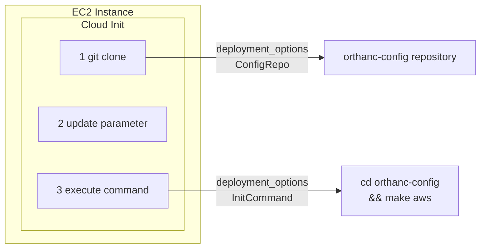

When an EC2 instance is launched, the cloud-init process executes a script as defined in user-data on the first boot. This initializes the configuration management.

## Pattern

The main steps of the user data script is illustrated below. 

<div style="text-align: center;">

</div>

First, the script pulls the configuration repo as specified to a local directory. Then it updates parameter file in the repo. Last, the scripts executes the command given in the variable, from the directory. They are configured in the Terraform variable `deployment_options`.


## Bootstrapping

The configuration management repo is [orthanc-config](https://github.com/digihunchinc/orthanc-config). Review the `README.md` file in the [repo](https://github.com/digihunchinc/orthanc-config) for details. In short, the repo suits multiple environments. For example, on AWS EC2, the initial command is to `make aws`. Under the hood, the `makefile` is the key to orchestrate the configuration activities in shell commands. Such activities include:

* Updating configuration file for Orthanc (e.g. S3 and database connectivity string)
* Checking dependencies on EC2 instance
* Building self-signed certificates
* Initializing database in RDS for Keycloak

The `makefile` takes environment variables set from `.env` file, which looks like this:

```sh

```
Some entries in this file are configured based on the Terraform templates input variable.

## Makefile
Here is what the `makefile` looks like to implement those activities:

```sh

```

By default, we use the cloud-init script invoke the make command.To watch for the log output and errors from during cloud-init, check the cloud init log file (/var/log/cloud-init-output.log) on the EC2 instance. For convenience, the output from the command also prints the next steps to finish the configuration.

A critical output of the `makefile` driven automation is the `docker-compose.yaml` file from the template, which allows user to start the system with docker compose command from the working directory. 