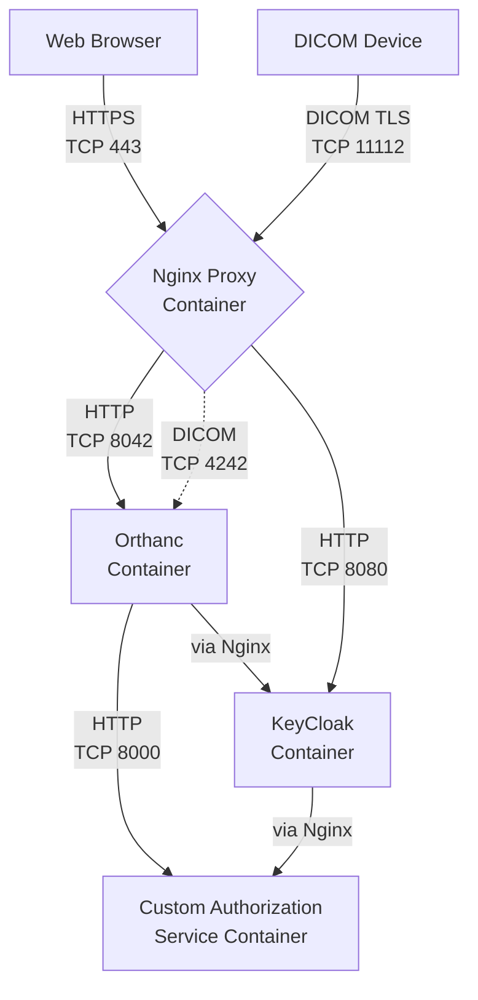

Upon launching the EC2 instances, the Orthweb solution can pull from a public Git repo and automatically completes the configuration of Orthanc. Orthweb completes a baseline configuration for Orthanc. The configuration was based on the reference configuration repo for [authorization service](https://github.com/orthanc-team/orthanc-auth-service), with some simplification efforts.

## Automation

The configuration files lives in a separate repo called [orthanc-config](https://github.com/digihunchinc/orthanc-config), or otherwise specified. If you have custom configuration, you may fork this repository and reference it when deploying Orthweb.

The repo directory can be placed in user directory `~` and it consists of a `makefile`. The file contains the steps and commands to automate the configuration for Orthanc. The `README.md` file in the repo has the instruction but the idea is to complete the installation with a single command. For example, on an EC2 instance, you may run `make aws`. This will call the required steps needed to configure Orthanc on the specific EC2 instance. On the other hand, if you simply need a generic development environment (e.g. on MacBook), you can run the `make dev` command. This command can even be supplied as a variable to the Terraform template such that it gets automatically executed.

The repo consists of several directories. The key directory is `config`, where each subfolder is mapped to a directory in the file systems of running containers. 

## Containers
The orthanc applciation consists of the following container-based services. The containers either uses pre-built images by orthanc-team, or images built as needed in the Docker compose file. How these containers interact with each other is illustrated as below:

The Nginx proxy is configured to direct traffic to different containers based on path. For example, if the request path is `/keycloak/*`, then the HTTP request is directed to keycloak container. If the request path is `/orthanc/*`, then it request is directed to Orthanc container. The Orthanc container is able to connect to S3 and PostgreSQL database.

## Plugins

One of the key configuration file is `orthanc.json`, which defines the required configurations. Available configuraiton options can be found in [Orthanc book](https://orthanc.uclouvain.be/book/). The [official plugins](https://orthanc.uclouvain.be/book/plugins.html#index-of-the-official-plugins) in the baseline configuration include:

- AWS S3 Storage Plugin (for deployment on EC2 only)
- PostgreSQL Index Plugin 
- Orthanc Explorer 2 Plugin
- Advanced Authorization Plugin
- DicomWeb Plugin
- Stone Web Viewer Plugin

The Authorization plugin requires use of the Orthanc Explorer 2 plugin, and integrates with the external custom authorization service. The PostgreSQL database is to index the study data. The imaging pixel data are stored to S3 bucket using the S3 Storage Plugin.