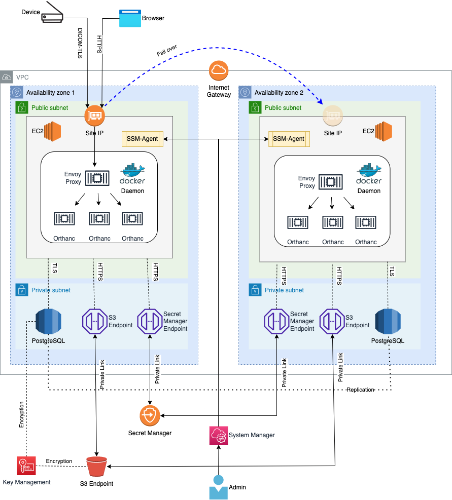

The Orthweb proposes a reference architecture to host Orthanc on AWS. The reference architecture does not include application traffic management. This section discusses how the components work in this architecture. The [next page](./applicationtraffic.md), will focus on the options for application traffic management.

## The Reference Arthicture

The architecure includes a VPC that spans across two availability zones (AZs). Each AZ has a public and a private subnet. Each public subnet stands one EC2 instance, with a public IP address routable from the Internet. The Reference Architecture is illustrated in the diagram below:



The two EC2 instances operates active-active, each with its own public IP. There are more options to manage application traffic and they are discussed separately in the section. The instances listens for DICOM (over TLS) and HTTPS traffic on TCP port `11112` and `443`. 

Within each EC2 instance, Docker daemon runs the required containers for Orthanc application. Orthweb uses [Docker Compose](https://docs.docker.com/compose/) to instruct Docker daemon how to orchestrate several containers of different purposes. The EC2 instances are launched using launch template.

The private subnet contains the network interface for RDS PostgreSQL database. For the Orthanc container to connect to S3, an S3 gateway endpoint is created in each AZ. Optionally and at additional cost, users may enable interface endpoints in each AZ to route AWS management traffic privately.

## Redundancy

The Orthweb solution provisions a pair of EC2 instances by default for redundancy. If you only need one of the two EC2 instance, feel free to stop the other one to avoid incurring charges. To stop and start an instance using AWS CLI, identify the instance ID and run:
```sh
aws ec2 stop-instances --instance-ids i-12345678  # instance billing stops
aws ec2 start-instances --instance-ids i-12345678  # instance billing restarts
```
Bear in mind that when there is only one EC2 instance running, it becomes a single point of failure.

The pair of EC2 instances, in conjunction with additional cloud resources, can bring high availability to the solution. However, the Orthweb solution does not intend to address high availability with its out-of-the-box configuration. For high availability, options are discussed under [application traffic management](applicationtraffic.md) and usually require additional customization efforts.

## Certificate

TLS certificate (either self-signed or BYO certificates) must be applied to both HTTP and DICOM ports for traffic encryption, because the data contains patient information and travels across the Internet. Provisioning third-party certificate is the responsibility of the user, and the process to provision TLS certificate for an organization varies largely depending on the Public Key Infrastructure (PKI). 

The Orthweb solution provisions self-signed certificate in the configuration. It automatically configures Nginx proxy using the self-signed certificate for both TCP ports (443 and 11112). The limitation with Self-signed certificates is that they are not broadly trusted. However, they can still encrypt the traffic. The self-signed certificate is issued to the public DNS name of the EC2 instance as the certificate Common Name, in the format of `ec2-pub-lic-ip-addr.<region>.compute.amazonaws.com`. 


## Network Paths
The EC2 instances handles network traffic for both business and management purposes. Assuming the application traffic coming from the Internet arrives at the network interface of the two EC2 instances, we consider the following traffic pathes:

* DICOM and web traffic: connection from client browser or DICOM AE travels across Internet and arrives at EC2's network interface via the Internet Gateway of VPC. Returning taffic directed to the client goes through Internet Gateway. Both types of traffic are by default protected with TLS (transport layer security).
* Database traffic: only Orthanc container in each EC2 instance makes connection to RDS instance. The endpoint of RDS instance is deployed in the prviate subnets of the VPC. The database traffic does not leave the VPC. The traffic is protected with TLS.
* AWS Management traffic: by default, AWS management traffic such as secret manager, KMS, are routed through the Internet, and are encrypted with TLS. Optionally, users may introduce their interface endpoints in the VPC in order to route such traffic privately. 

  | Choice of interface endpoints in VPC | Routing Pattern | Tradeoff
  | -------- | ------- | ------- |
  | `[]` (none by default) | Without any interface endpoints, all types of AWS management traffic are routed through Internet. | Most cost-efficient configuration. |
  | `["kms","secretsmanager"]`    | Traffic for critical management traffic (secrets and keys) is routed privately  | A balanced configration between security risk and cost |
  | `["kms","secretsmanager","ec2","ssm","ec2messages","ssmmessages"]` | All types of AWS management traffic are routed privately.    | Most secure configuration but each interface endpoint incurs its own cost. |


* AWS Data Traffic: the EC2 instances makes connection to S3 to store imaging data. The terraform template creates S3 Gateway Endpoint such that the traffic from EC2 instance to S3 is routed privately. The traffic to S3 is protected with TLS encryption.

## Compliance

Below are some other concers in regard with the configurations for security compliance:

1. Both DICOM and web traffic are encrypted in TLS. This requires peer DICOM AE to support DICOM TLS as well.
2. PostgreSQL data is encrypted at rest, and the database traffic between Orthanc application and database is encrypted in SSL. The database endpoint is not open to public.
3. The S3 bucket has server side encryption. The traffic in transit between S3 bucket and Orthanc application is encrypted as well.
4. The password for database are generated dynamically and stored in AWS Secret Manager in AWS. The EC2 instance is granted access to the secret, which allows the configuration script to fetch the secret and launch container with it. 
5. The self-signed X509 certificate is dynamically generated using openssl11 during bootstrapping, in compliance with [Mac requirement](https://support.apple.com/en-us/HT210176).
6. Secret Manager, S3 and the KMS key used to encrypt objects and secrets all use resource-based IAM role to restrict access.
7. VPC flow log and S3 access log are sent to a separate S3 bucket. However, the S3 access log usually takes 10 minutes to be delivered.


## Limitations
Currently there are also some limitation with secure configuration:

1. Database secret rotation isn't implemented. Instead, Database password is generated at Terraform client and then sent to deployment server to create PostgreSQL. The generated password is also stored in state file of Terraform. To overcome this, the application would need to automatically receive secret update.
2. Secret management with Docker container: secret are presented to container process as environment variables, instead of file content. This is generally secure enough but not the best practice, as per [this article](https://techbeacon.com/devops/how-keep-your-container-secrets-secure).
3. Self-signed certificates are often flagged by the Browser as insecure. So users are advised to use their own certificates.