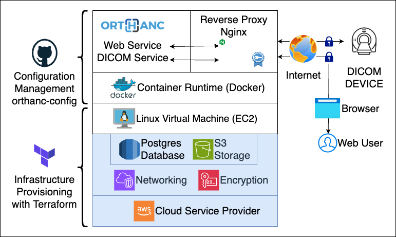

# Orthweb - Orthanc on AWS

 

## Overview

The **[Orthweb](https://github.com/digihunch/orthweb)** project helps imaging IT staff build an **[Orthanc](https://www.orthanc-server.com/)** solution on AWS. The project addresses the cloud foundation and deployment automation for Orthanc. For step-by-step instructions and architectural discussions, follow to the [documentation](https://digihunch.github.io/orthweb/).

Orthanc handles sensitive data and must operate on a secure cloud platform. Typically, large organizations can afford dedicated IT resources to build their enterprise-scale cloud foundation on AWS. This cloud foundation is known as a [landing zone](https://www.digihunch.com/2022/12/landing-zone-in-aws/). Each department in the organization is allocated with a segment of the landing zone, and deploys their own applications therein. 

In reality, many Orthanc adopters are small entities (e.g. startups, research groups, independent clinics, etc) without an overarching cloud strategy. To leverage Orthanc in the cloud, they need a secure and scalable cloud foundation. To fill this gap, **Orthweb** project was [created](https://www.digihunch.com/2020/11/medical-imaging-web-server-deployment-pipeline/) as a cloud-based Orthanc solution, to address the cloud foundation and deployment automation.

  

To address the cloud foundation, **Orthweb** project uses **Terraform** template (an infrastructure-as-code technology) provisions its own self-contained infrastrcture stack in a single AWS account. It does not rely upon an established network infrastructure platform. The network infrastructure layer provisioned in this project contains a single VPC with multiple subnets, along with required endpoints. The infrastructure layer also contains encryption keys, managed database service and S3 storage. The infrastrcture footprint is small but secure. It aims to comply with regulatory requirements such as HIPPA. However, regulatory auditing is the responsibility of the Orthanc adopter. To address deployment automation, **Orthweb** project leverages cloud-init [user data](https://docs.aws.amazon.com/AWSEC2/latest/UserGuide/user-data.html) to initialize the servers. The configuration to install **Orthanc** is stored in the [orthanc-config](https://github.com/digihunchinc/orthanc-config) repository. 
  
Bring your own AWS account, let **Orthweb** set up an Orthanc server within 30 minutes, and start to serve HTTP and DICOM traffic. The project architecture also takes into account other operational aspects, such as high availability, resiliency and automation in the configuration of **Orthanc** application with Docker, using the official [Orthanc image](https://hub.docker.com/r/orthancteam/orthanc). For those considering hosting Orthanc on Kubernetes, check out our sister project [Korthweb](https://github.com/digihunch/korthweb).